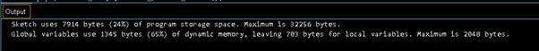
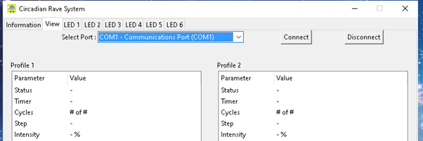
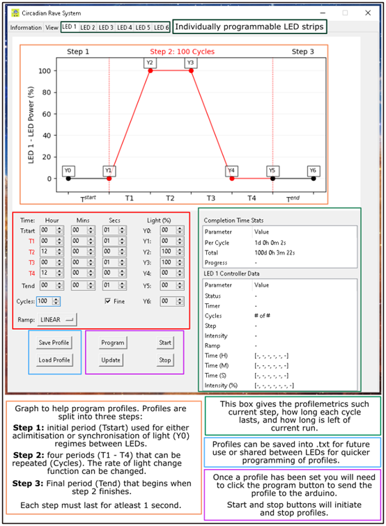
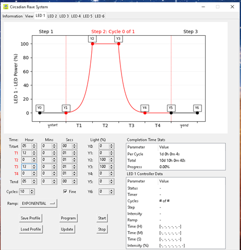
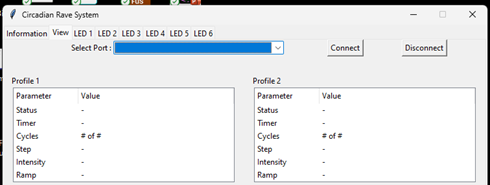

# Circadian Rave System (CRS)

  

__Overview of the CRS__

We have designed an affordable, high-precision, and compact system that enables users to perform light manipulation experiments on a variety of organisms. This system was designed for in laboratories specifically in incubators and has been successfully used at 15 – 30°C, and the software has been tested on both windows and mac.
Key features of the CRS include:

- Fully programmable LEDs allowing lighting paradigms that can last years
- Each unit consists of six independent lighting channels giving the user scalability of experimental arms
- The system uses an Arduino controller making the system accessible and affordable
- 

  

A user via a PC app can design any conceivable light regime for each of the LED strips (currently up to 6). The PC app will then send this information to the controller which will control the brightness and timings of the LED strips for the duration of the experiments.

__Installing firmware__

The CRS firmware consists of a definition.h file and a CircadianRaveSystem.ino file, and both can be found in the GitHub repository folder titled “firmware”, or at the end of this document.

1.)	Download and install the Arduino IDE software from the [Arduino website](https://www.arduino.cc/software). 

2.)	In the Arduino IDE software select the correct Arduino COM port. Next go to file>Open… and select the folder containing the definition.h and CircadianRaveSystem.ino files.

  

3.)	Once a new window opens, click verify and upload to install firmware on the Arduino. The output should display this:

  

4.)	Disconnect the now ready to use Arduino.

__Testing the CRS__

Prior to running experiments with the CRS, we suggest testing that each LED strip of the CRS works reliably for a couple of days. To do this run the CRS_test_profile.txt file found in the CRS/Software/Test. Go to Loading profiles section for instructions on how to run the CRS_test_profile file.

__Running an experiment on the CRS__

The CRS software can be directly downloaded and installed from CRS/Software/bin/. The software has been tested on both mac and Windows operating systems:
- For Windows 10 and 11 download Circadian-Rave-System-v1.2.exe file
- For macOS Ventura download Circadian-Rave-System-v1.2.dmg file
  
__Connecting to CRS hardware__

Power on the CRS and connect to the computer with the FTDI lead using the horizontal pins on the PCB. Open CRS software and in the View tab click the ‘Select Port’ dropdown menu, select the Arduino and click connect and the six LED tables should all update when connected. If experiments were running, each profile would update accordingly. Each CRS LED strip is now ready to be programmed.

  

__Programming the CRS__

The CRS was designed with Circadian experiments in mind and we have tried to add as much functionality as possible. Each LED can be independently programmed using the LED tabs (See top of figure below). The example profile below is a program that has a 1 second 0% light followed by 100 cycles of step 2. Step 2 is 12 hours of 100% light (T2) followed by 12 hours of 0% light (T4), mimicking  day/night cycle. T1 and T3 are the ramp up and down periods between day and night each lasting 1 second, and the ramp button is set to LINEAR, referring to the function of the light ramping.

  

Here is another example of a profile where the ramping function has been changed to an exponential function and that the ramping periods both last 12 hours. This is an example of a profile that might better reflect true changes in light levels through out the day.

  

__Saving and loading light profiles__
-	__Saving profiles__
  
Once a desired profile has been made we recommend saving it using the Save Profile button. The profile is saved to a text file that can be read by the software to program concurrently running LED profiles or future experiments.
 
-	__Loading Profiles__
  
 For testing, we recommend running the tester profile for each LED strip simultaneously. Go to the LED tabs, click on the Load profile and click on the CRS_test_profile.txt. Click Program to upload the profile into the CRS and the graph should update along with the profile statistics. Click start and the graph will live update with the progress of the run. Repeat this for all six LED profiles.

__Disconnecting from CRS hardware__

Disconnect with the Disconnect button located in the view tab, the FTRI lead can now be safely removed at this point. 

  

__Checking progress of experiments__

Whilst the CRS is running the status of profiles can be checked by simply following the connecting to hardware section. The view tab has all current information of all 6 LED tabs. Disconnect as previously described.
