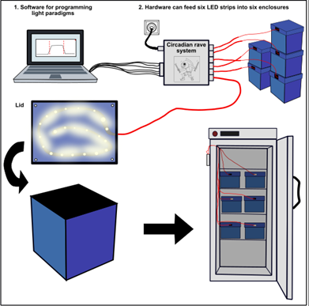

# Circadian Rave System (CRS)

  

__Overview of the CRS__

We have designed an affordable, high-precision, and compact system that enables users to perform light manipulation experiments on a variety of organisms. This system was designed for in laboratories specifically in incubators and has been successfully used at 15 – 30°C, and the software has been tested on both windows and mac.
Key features of the CRS include:

- Fully programmable LEDs allowing lighting paradigms that can last years
- Each unit consists of six independent lighting channels giving the user scalability of experimental arms
- The system uses an Arduino controller making the system accessible and affordable
- 

  

A user via a PC app can design any conceivable light regime for each of the LED strips (currently up to 6). The PC app will then send this information to the controller which will control the brightness and timings of the LED strips for the duration of the experiments.

__Installing firmware__

The CRS firmware consists of a definition.h file and a CircadianRaveSystem.ino file, and both can be found in the GitHub repository folder titled “firmware”, or at the end of this document.

1.)	Download and install the Arduino IDE software from the [Arduino website](https://www.arduino.cc/software). 

2.)	In the Arduino IDE software select the correct Arduino COM port. Next go to file>Open… and select the folder containing the definition.h and CircadianRaveSystem.ino files.

  

